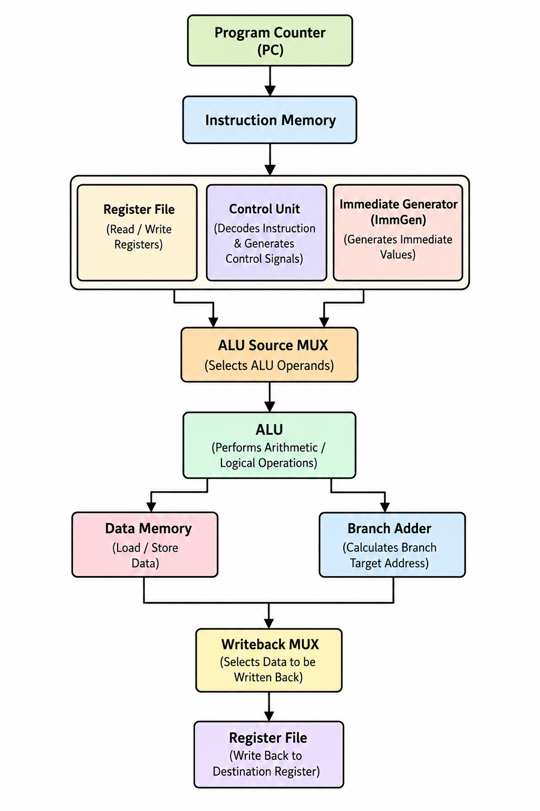

<div align="center">

# 🚀 32-bit Single-Cycle RISC-V Processor


**A 32-bit Single-Cycle RISC-V Processor designed in Verilog HDL, verified using ModelSim, and implementing a subset of the RISC-V RV32I Instruction Set Architecture.**

</div>

---

## 📖 Project Overview

This repository presents the design and implementation of a **32-bit Single-Cycle RISC-V Processor** based on the open-source **RISC-V RV32I Instruction Set Architecture (ISA)**.

The processor is developed entirely in **Verilog HDL** using a modular hardware design approach. Each functional block—including the Program Counter, Instruction Memory, Register File, Immediate Generator, Control Unit, ALU Control Unit, Arithmetic Logic Unit (ALU), Data Memory, and Multiplexers—was designed independently and then integrated into a complete processor datapath.

The processor executes one instruction per clock cycle and supports a subset of the RV32I instruction set, including arithmetic, logical, immediate, load/store, branch, and jump instructions.

The complete design has been functionally verified through simulation using **ModelSim**, with dedicated testbenches and custom RISC-V assembly programs converted into machine code for execution.

This project was developed as part of an RTL-to-GDSII learning journey to gain a strong understanding of processor architecture, digital design, computer organization, and Verilog-based hardware implementation.

---

## ✨ Features

- ✅ 32-bit Single-Cycle RISC-V Processor
- ✅ Implements a subset of the **RV32I Instruction Set Architecture**
- ✅ Designed completely in **Verilog HDL**
- ✅ Modular RTL design for easy understanding and scalability
- ✅ Executes one instruction per clock cycle
- ✅ Supports arithmetic and logical operations
- ✅ Supports immediate instructions
- ✅ Supports load and store memory operations
- ✅ Supports conditional branch instructions
- ✅ Supports unconditional jump instructions
- ✅ Dedicated ALU Control Unit for instruction decoding
- ✅ 32 × 32-bit Register File
- ✅ Immediate Generator supporting multiple instruction formats
- ✅ Separate Instruction Memory and Data Memory
- ✅ Write-back architecture using a dedicated multiplexer
- ✅ Functional verification performed using **ModelSim**
- ✅ Tested using custom RISC-V assembly programs

---

# 🏗️ Processor Architecture

The processor follows a **Single-Cycle RISC-V Datapath**, where every instruction is fetched, decoded, executed, and completed within a single clock cycle.

The design is divided into multiple RTL modules, each responsible for a specific function in the datapath. These modules are interconnected to perform instruction execution according to the RISC-V RV32I specification.

## Major Hardware Modules

| Module | Function |
|---------|----------|
| Program Counter (PC) | Stores the address of the current instruction |
| Instruction Memory | Fetches instructions using the Program Counter |
| Register File | Stores 32 general-purpose registers and provides source operands |
| Immediate Generator | Generates sign-extended immediate values for different instruction formats |
| Main Control Unit | Generates control signals based on the instruction opcode |
| ALU Control Unit | Decodes instruction fields and selects the ALU operation |
| ALU | Performs arithmetic and logical operations |
| Data Memory | Executes load and store operations |
| Branch & Jump Adder | Computes branch and jump target addresses |
| PC Select MUX | Chooses the next Program Counter value |
| ALU Source MUX | Selects between register data and immediate value |
| Writeback MUX | Selects the value written back to the Register File |

---

---

# 🏗️ Processor Architecture

The proposed processor follows a **32-bit Single-Cycle RISC-V (RV32I)** architecture. It is designed using a modular datapath that performs instruction fetch, decode, execution, memory access, and write-back within a single clock cycle.


  <p align="center">
  
</p>
<p align="center">
<b>Figure 2.</b> Final Processor Verification in ModelSim
</p>
The architecture consists of interconnected modules including the **Program Counter (PC), Instruction Memory, Register File, Control Unit, Immediate Generator, ALU Source Multiplexer, Arithmetic Logic Unit (ALU), Data Memory, Branch Address Generator, and Writeback Multiplexer**. These modules work together to execute RISC-V instructions efficiently while maintaining a simple and modular hardware design.

---

# 📂 Project Structure

```text
RISC-V-Single-Cycle-Processor
│
├── rtl/                  # Verilog RTL source files
├── testbench/            # Testbenches for simulation
├── program/              # RISC-V assembly programs and machine code
├── waveforms/            # ModelSim waveform screenshots
├── images/               # Architecture and datapath diagrams
├── docs/                 # Project documentation and report
├── LICENSE
└── README.md
```

## Directory Description

- **rtl/** – Contains all Verilog HDL modules implementing the processor.
- **testbench/** – Simulation testbenches used to verify the RTL.
- **program/** – Assembly programs, generated machine code, and memory initialization files.
- **waveforms/** – Simulation waveform screenshots captured from ModelSim.
- **images/** – Block diagrams, datapath figures, and architecture illustrations.
- **docs/** – Project report and supporting documentation.

---

# 📖 Supported RV32I Instructions

The current implementation supports a subset of the **RISC-V RV32I Instruction Set Architecture**, covering arithmetic, logical, memory access, branch, and jump operations.

| Category | Instructions |
|----------|--------------|
| Arithmetic | `ADD`, `SUB`, `ADDI` |
| Logical | `AND`, `OR`, `XOR`, `ANDI`, `ORI`, `XORI` |
| Shift | `SLL`, `SRL`, `SRA`, `SLLI`, `SRLI`, `SRAI` |
| Comparison | `SLT`, `SLTU`, `SLTI`, `SLTIU` |
| Load | `LW` |
| Store | `SW` |
| Branch | `BEQ` |
| Jump | `JAL` |

---

# 🧩 Implemented RTL Modules

The processor is designed using a modular RTL approach. Each hardware component is implemented as an independent Verilog module.

| Module | Description |
|---------|-------------|
| `pc.v` | Program Counter |
| `instruction_memory.v` | Instruction Memory |
| `regfile.v` | 32 × 32-bit Register File |
| `immediate_generator.v` | Immediate Generator |
| `control_unit.v` | Main Control Unit |
| `alu_control.v` | ALU Control Unit |
| `alu.v` | Arithmetic Logic Unit |
| `alu_src_mux.v` | ALU Source Multiplexer |
| `datamem.v` | Data Memory |
| `branchjumpadder.v` | Branch & Jump Address Generator |
| `pcselectmux.v` | PC Selection Multiplexer |
| `writebackmux.v` | Writeback Multiplexer |
| `riscv_top.v` | Top-level Processor Integration |

---

---

# 🔄 Processor Execution Flow

Each instruction passes through the following stages during execution:

```text
        Reset
          │
          ▼
 Program Counter (PC)
          │
          ▼
 Instruction Fetch
          │
          ▼
 Instruction Decode
          │
          ▼
 Read Register Operands
          │
          ▼
 Generate Immediate
          │
          ▼
 ALU Operation
          │
          ▼
  ┌───────────────┐
  │               │
  ▼               ▼
Memory Access   Branch/Jump
  │               │
  └──────┬────────┘
         ▼
 Writeback MUX
         │
         ▼
 Register File
         │
         ▼
 Next Program Counter
```

### Instruction Execution Sequence

1. The **Program Counter (PC)** stores the address of the current instruction.
2. The **Instruction Memory** fetches the instruction.
3. The **Control Unit** decodes the opcode and generates control signals.
4. The **Register File** provides the required source operands.
5. The **Immediate Generator** creates the required immediate value.
6. The **ALU Control Unit** selects the appropriate ALU operation.
7. The **ALU** performs arithmetic or logical operations.
8. **Data Memory** performs load/store operations when required.
9. The **Writeback Multiplexer** selects the value to write into the destination register.
10. The **PC Select Multiplexer** chooses the next instruction address (PC + 4 or Branch/Jump Target).

---

---

# 🧪 Simulation & Verification

The complete processor was functionally verified using **ModelSim**. Each RTL module was first tested individually using dedicated testbenches before integrating the complete processor.

After integration, a custom RISC-V test program was executed to verify the correct operation of the datapath and control logic.

# 🧪 Final Processor Verification

The processor was verified using a comprehensive RISC-V test program covering arithmetic, logical, memory, branch, and jump instructions. The program was assembled into machine code and loaded into the instruction memory for simulation in ModelSim.

## Test Program (Machine Code)

```text
00500093
00A00113
002081B3
40118233
0021F2B3
0020E333
0020C3B3
00302023
00002403
00184663
06300493
0080056F
04D00593
0020E613
00667693
00000063
```

### Instructions Executed

| Machine Code | Instruction |
|--------------|-------------|
| 00500093 | `addi x1, x0, 5` |
| 00A00113 | `addi x2, x0, 10` |
| 002081B3 | `add x3, x1, x2` |
| 40118233 | `sub x4, x3, x1` |
| 0021F2B3 | `and x5, x3, x2` |
| 0020E333 | `or x6, x1, x2` |
| 0020C3B3 | `xor x7, x1, x2` |
| 00302023 | `sw x3, 0(x0)` |
| 00002403 | `lw x8, 0(x0)` |
| 00184663 | `beq x3, x8, label` |
| 06300493 | `addi x9, x0, 99` *(skipped when branch is taken)* |
| 0080056F | `jal x10, done` |
| 04D00593 | `addi x11, x0, 77` *(skipped after jump)* |
| 0020E613 | `ori x12, x1, 2` |
| 00667693 | `andi x13, x12, 6` |
| 00000063 | `beq x0, x0, end` |


## Final Verification Waveform

<p align="center">
  
</p>

<p align="center">
<b>Figure.</b> Functional verification of the complete 32-bit Single-Cycle RISC-V Processor in ModelSim using a comprehensive instruction test program.
</p>


## Verification Methodology

The following verification steps were performed:

- ✔ Individual module verification
- ✔ Top-level processor simulation
- ✔ Instruction-by-instruction execution
- ✔ Register file verification
- ✔ Data memory read/write verification
- ✔ ALU operation verification
- ✔ Branch decision verification
- ✔ Jump instruction verification
- ✔ Writeback verification

The waveform analysis confirmed that all supported instructions were executed correctly and the expected results were written back to the destination registers.

---
# ✅ Verification Summary

The processor was verified using:

- Individual module testbenches
- Integrated processor simulation
- Custom RISC-V assembly programs
- ModelSim waveform analysis

Verified functionality includes:

- Arithmetic instructions
- Logical instructions
- Immediate instructions
- Load/Store operations
- Branch instructions
- Jump instructions
- Register write-back

# 📈 Results

The processor successfully executed a custom RISC-V test program covering arithmetic, logical, memory, branch, and jump instructions.

### Successfully Verified

- Arithmetic Operations
- Logical Operations
- Immediate Instructions
- Register File Read/Write
- Memory Read (LW)
- Memory Write (SW)
- Branch (BEQ)
- Jump (JAL)
- Writeback Logic
- Complete Datapath Integration

The ModelSim simulation confirms the correct generation of control signals, ALU operations, memory access, and register writeback for all supported instructions.

---

# 🔮 Future Improvements

The current processor implements a subset of the RV32I instruction set. Future enhancements include:

- Complete support for the full RV32I instruction set.
- Design and implement a 5-stage pipelined RISC-V processor.
- Implement FPGA-based hardware validation.
- Extend the design towards the complete RTL-to-GDSII flow.

# 👩‍💻 Author

**P. Lovely Priya**

B.Tech in Electronics and Communication Engineering

Project Focus:
- Digital Design
- Verilog HDL
- RISC-V Processor Design
- VLSI Design
- RTL-to-GDSII Flow

GitHub: https://github.com/lovelypriya2005

---
# 📜 License

This project is licensed under the **MIT License**.

See the LICENSE file for details.
